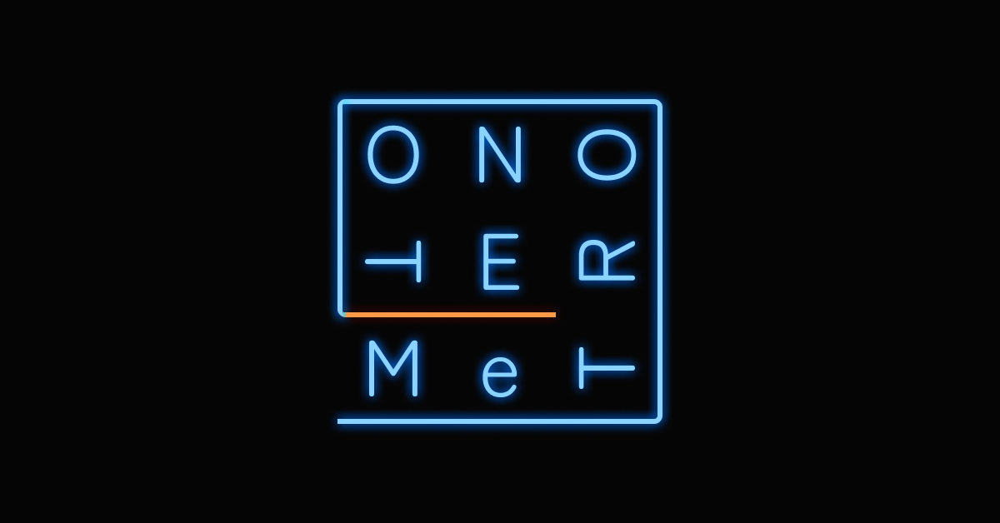

# プロジェクト名：『MeTRO NOTE』

# 目次
- [サービス概要](#-サービス概要)
- [サービスURL](#-サービスurl)
- [サービス開発の背景](#-サービス開発の背景)
- [機能紹介](#-機能紹介)
- [技術構成について](#-技術構成について)
  - [使用技術](#使用技術)
  - [ER図](#er図)
  - [画面遷移図](#画面遷移図) 
 

# サービス概要
バンドメンバーのマッチングアプリです。 

ユーザーの音楽的な能力、趣向を可視化します。 

メンバー探しや、趣向の近いユーザー同士の交流ツールを目的とします。 
 

# サービスURL
### https://metronote.jp 
 

# サービス開発の背景
私は高校生からバンド活動、その後は音楽大学で勉強や練習、音楽活動をしていました。 
それらの経験の中で感じたのは、音楽での成功は仲間の存在や仲間の能力一つで大きく変わりうるということでした。 
 
そのためにバンドメンバーを探すマッチングアプリは存在しても、私の周りで使ってる人はほとんど見かけません。 
 
私が感じた理由としては、
- バンド練習と言って異性と出会い目的で使う悪質なユーザーがいる。
- 10代20代が少ない。
- それらの理由により活気がない、人数が少ない。 
 

つまり現状、音楽をする上で必要なメンバー探しを理想的に叶えてくれるツールが実質存在していないように思えます。 
よってその問題を解決するために、本気の人間かを把握できる、たくさんの人が集まるバンドメンバーマッチングアプリをつくりたいと考え、開発するに至りました。 
 

# 機能紹介

| ユーザー登録 / ログイン |
| :---: | 
|  |
| 
『名前』『メールアドレス』『パスワード』『確認用パスワード』を入力してユーザー登録を行います。ユーザー登録後は、自動的にログイン処理が行われるようになっており、そのまま直ぐにサービスを利用する事が出来ます。
 |
 

| 『私を構成する9枚』作成 |
| :---: | 
|  |
| 
好きな9枚のアルバムを登録して、『私を構成する9枚』を作成できます。
 |
 

| 『私を構成する9枚』共有 |
| :---: | 
|  |
| 
『私を構成する9枚』を動的OGPとしてXで共有できます。
 |
 

| 『私を構成する9枚』マッチング |
| :---: | 
|  |
| 
自分の『私を構成する9枚』と他のユーザーの『私を構成する9枚』のマッチ度をAIやアルゴリズムが評価、並び替えをします。
 |
 

| 音楽クイズ |
| :---: | 
|  |
| 
音楽の問題を出題。正解するとランクが上がってプロフィールに表示されたり、テスト順に並び変えた時に上位に表示されます。
 |
 

| チャット機能 |
| :---: | 
|  |
| 
他のユーザーとメッセージのやり取りができます。
 |
 

| いいね機能・通知機能|
| :---: | 
|  |
| 
お気に入りのユーザーをいいねできます。それらのユーザーの一覧画面もあります。 また、チャットといいねは受け取ると、リアルタイムでヘッダーのアイコンが光る仕様です。
 |
 

# 技術構成について

## 使用技術
| カテゴリ | 技術内容 |
| --- | --- | 
| サーバーサイド | Ruby on Rails 7.1.3.4・Ruby 3.1.4 |
| フロントエンド | Ruby on Rails・JavaScript |
| CSSフレームワーク | Tailwindcss|
| Web API | OpenAI API(GPT-4)|
| データベースサーバー | PostgreSQL |
| ファイルサーバー | AWS S3 |
| アプリケーションサーバー | Heroku |
| バージョン管理ツール | GitHub|
 

## ER図

 

## 画面遷移図
https://www.figma.com/design/mSpr7uukL96Z7vVGmuyinA/%E5%8D%92%E6%A5%AD%E5%88%B6%E4%BD%9CUI?node-id=0-1&t=3C7fo46dZeLdAfAg-1

